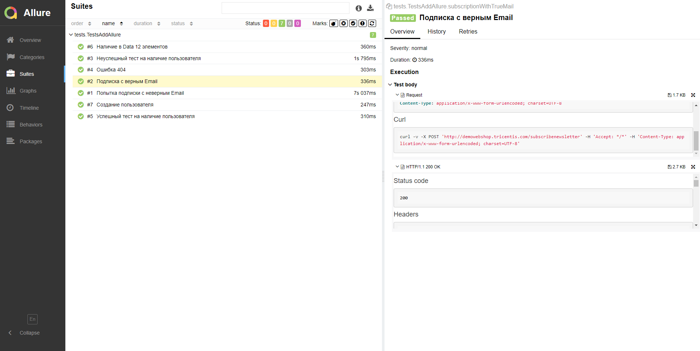

# Проект API автоматизации для сайта reqres.in

## :scroll: Структура:

- <a href="#toolbox-технологии-и-инструменты">Стек</a>
- <a href="#arrow_forward-проведенные автотесты">Автотесты</a>
- <a href="#bar_chart-сборка-в-Jenkins">Сборка в Jenkins</a>
- <a href="#loudspeaker-allure-отчет">Allure отчет</a>
- <a href="#robot-отчет-в-telegram">Отчет в Telegram</a>

## :toolbox: Стек:

## :arrow_forward: Автотетсы
- Проверка наличия пользователя на странице
- Проверка на отсутсвие пользователя на странице
- Создание пользователя на странцие
- Проверка наличия элементов в "DATA"
- Проверка отсутсвия страницы (код 404)
- Проверка подписки с неверным Email
- Проверка подписки с верным Email

## :bar_chart: Сборка в Jenkins
## <a target="_blank" href="https://jenkins.autotests.cloud/job/AWEM_Tests_QA_Guru_11_Diploma/">Сборка в Jenkins</a>

## :loudspeaker: Allure отчет
- ### Главный экран отчета

- ### :clipboard: Страница с проведенными тестами

## :ticket: Интеграция с Allure TestOps
- ### Экран с результатами запуска тестов

- ### Страница с тестами в TestOps

## :robot: Отчет в Telegram

